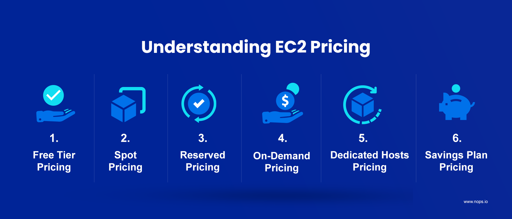

# EC2 and its Pricing

## What is EC2?

Amazon Elastic Compute Cloud (Amazon EC2) provides on-demand, scalable computing capacity in the Amazon Web Services (AWS) Cloud. Using Amazon EC2 reduces hardware costs so you can develop and deploy applications faster. You can use Amazon EC2 to launch as many or as few virtual servers as you need, configure security and networking, and manage storage. You can add capacity (scale up) to handle compute-heavy tasks, such as monthly or yearly processes, or spikes in website traffic. When usage decreases, you can reduce capacity (scale down) again. In practice, EC2 makes life easier for developers by providing secure, and resizable compute capacity in the cloud. It greatly eases the process of scaling up or down, can be integrated into several other services, and comes with a plan where you only pay for how much you use it.

## Features

- **Instances** - Virtual Servers
- **Amazon Machine Images (AMIs)** - Preconfigured templates for your instances that package the components you need for your server (including the operating system and additional software).
- **Instance Types** - Various configurations of CPU, memory, storage, networking capacity, and graphics hardware for your instances.
- **Amazon EBS volumes** - Persistent storage volumes for your data using Amazon Elastic Block Store (Amazon EBS).
- **Instance store volumes** - Storage volumes for temporary data that is deleted when you stop, hibernate, or terminate your instance.
- **Key pairs** - secure login information for your instances. AWS stores the public key and you store the private key in a secure place.
- **Security Groups** - A virtual firewall that allows you to specify the protocols, ports, and source IP ranges that can reach your instances, and the destination IP ranges to which your instances can connect.

## Related Services

- Amazon EC2 Auto Scaling
- AWS Backup
- Amazon CloudWatch
- Elastic Load Balancing
- Amazon GuardDuty
- EC2 Image Builder
- AWS Launch Wizard
- AWS Systems Manager

## Pricing for Amazon EC2

- **Free Tier** - You can get started with Amazon EC2 for free.
- **Spot Instances** EC2 Spot pricing is by far the cheapest, saving you up to 90% off standard pricing. This pricing method lets you use surplus EC2 computing capacity for yourself until AWS needs it back for other customers.
  Spot prices are not fixed. There is a bidding process for them, and AWS constantly adapts them to market demand across different Availability Zones. The only time you use them is when your bid (request rate) is higher than the offered Spot Price.
  Here’s the tradeoff. If others outbid you on your maximum price, or if demand increases and supply decreases, AWS discontinues your Spot Instances. For fault-intolerant applications, this interruption can lead to service disruption.
  In addition, Amazon EC2 automatically switches to the more expensive On-Demand pricing after reclaiming Spot instances, which can blow a hole in your budget.
  Now, you could manually configure Hibernate or Pause-Stop features to mitigate the risks. With multiple instances or use cases running, this can be overwhelming and time-consuming. Fortunately, tools like Xosphere automate switching between Spot instances so you can take advantage of Spot pricing.

- **Reserved Instances** - If you commit to consistent usage over one or three years, using EC2 Reserved Instances pricing can save you up to 72% compared to On-Demand prices. The other advantage here is that you get to reserve capacity in a specific Availability Zone, enabling you to launch new instances whenever you need them.
  - Standard Reserved Instances pricing enables you to save up to 72% vs On-Demand pricing, and you can change the Availability Zone, instance size, and networking of your Standard RIs within the contract term.
  - Convertible Reserved Instances pricing lets you apply up to 66% discounts across instance types, tenancy types, and operating systems of your RIs during the contract period.

Like Savings Plans, you can pay for RIs all upfront, partially upfront, or monthly without a down payment. Of course, the more you pay upfront, the higher your savings.

- **On-Demand Instances** - EC2 On-Demand pricing lets you choose any instance type and size, scale resources up and down as needed, and pay only for what you use. No upfront payments. No long-term commitment required. You can also decide when specific EC2 instances should be deployed, terminated, rebooted, or hibernated. Billing is also hourly or per second. In addition, EC2 On-Demand pricing is available for all Availability Zones (AZs), Regions, and operating systems (Linux, Windows, and RedHat Enterprise Limited Edition (RHEL)). This is also the default pricing for EC2 instances and offers the most flexibility. The tradeoff is that On-Demand pricing is more expensive than other EC2 pricing methods, as you’ll notice below. Also, On-Demand pricing is highly variable and depends on your choice of region/availability zone, OS, instance type, and instance size.

- **Dedicated Hosts** - A dedicated host is essentially a physical server that provides instance capacity specifically to you. This EC2 pricing method blends the resilience and flexibility of the AWS public cloud with the cost savings of using your own licenses (such as your Windows SQL server license).
  The plan bills users based on the On-Demand rate per hour, not per second. However, if you purchase them on a reservation basis for one or three years, you get up to 70% off On-Demand hourly pricing.
  You can also save up to 72% on Dedicated Hosts versus On-Demand pricing when you use Savings Plans for Dedicated Hosts.
  This pricing approach makes sense for companies seeking to maintain compliance or minimize hardware sharing for security reasons.

- **Savings Plan** - A one- or three-year EC2 Savings Plan can save you up to 72% off regular On-Demand pricing. AWS Savings Plans require you to commit to consistent usage in dollars per hour, such as $8/hour for one or three years. Amazon EC2 Instance Savings Plans let you switch between EC2 instance types and operating systems during your contract period. But it locks you into one instance type (family) and AWS Region over the course of that contract. Say, you configured an M5.xl instance in US East (North Virginia) running Windows, to begin with. An EC2 Instance Savings Plan lets you:
  - Increase or decrease the instance size to suit changes in your usage
  - Switch from Windows to a Linux instance, and vice versa
  - Change tenancy (dedicated or shared)
  - Change Availability Zone (AZ)

For example, you can switch from the M5.xl running Windows in US East (North Virginia) to an M5.2xl running Linux in US East (North Virginia) to increase capacity. But you won’t be able to switch from the M5.xl running Windows to a T3.xl running Windows or Linux. Also, you cannot migrate to US West (Ohio) to host the same Windows M5.xl instance.
Compute Savings Plans offer discounts of up to 66% compared to On-Demand EC2 pricing.
Despite their lower discounts, these plans apply to multiple AWS services (Amazon EC2, AWS Fargate, and AWS Lambda), regions, instance families, instance sizes, and operating systems.
One more thing. Your Savings Plans discount amount will also depend on the payment plan you choose:

- All upfront – Get the most savings when you pay for the entire plan at the beginning
- Partial upfront – Save when you pay at least 50% down
- No upfront – You’ll pay your commitment monthly over the term of your contract with some savings
