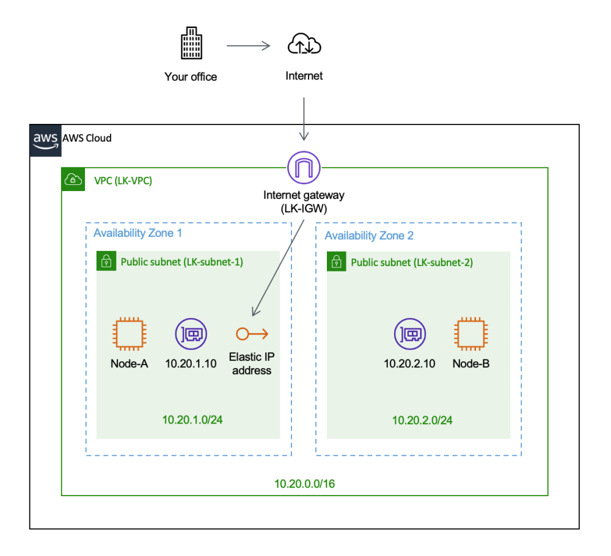
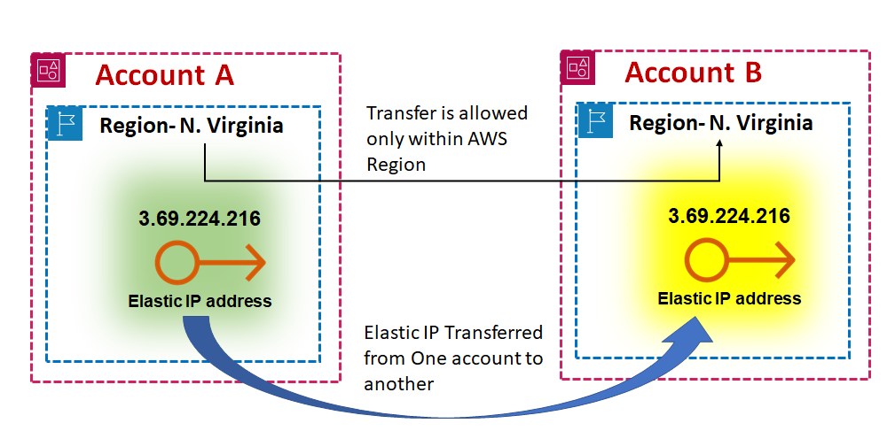
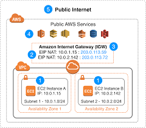

# Elastic IP Address

An Elastic IP address (EIP) is a static, public IPv4 address in AWS, designed for the dynamic nature of cloud computing. EIPs allow users to manage resilient public endpoints in cloud infrastructure, offering flexibility in instance management and failover.

## Key Features and Benefits of Elastic IPs

1. **Instance Failover**: If an EC2 instance fails, EIPs can be quickly reassigned to another instance in the same VPC, maintaining a consistent public endpoint and reducing downtime.
2. **Flexible Traffic Management**: EIPs can be programmatically associated or disassociated with instances to direct traffic as business needs evolve.

3. **Persistent Public Endpoint**: EIPs provide stable identifiers for resources, which is helpful when configuring DNS records or firewall rules, ensuring reliable connectivity.

## Important Considerations

- **Single Association**: Each EIP can be attached to one instance or network interface at a time. However, it can be moved to another as needed.
- **Automatic IP Release**: Associating an EIP with an instance's primary network interface (eth0) releases its existing public IPv4 address back to AWS.
- **IPv4 Limitation**: AWS limits users to five Elastic IPs per region; using a NAT device is recommended to conserve them.
- **IPv6 Support**: Currently, EIPs support only IPv4, not IPv6.

## Security and Access

EIPs are accessible from the internet when allowed by the instance’s security groups and network ACLs. For returning traffic, an internet gateway is required within the VPC.

## Cost and Tagging

Elastic IPs incur charges when not associated with a running instance. Tags can be applied to EIPs for tracking usage costs in AWS Cost Explorer:
- **Active IP Costs**: Costs can be tracked under `PublicIPv4InUseAddress`.
- **Idle IP Costs**: EIPs attached to stopped instances are considered idle and can be tracked under `PublicIPv4IdleAddress`. AWS charges around $0.005 per hour (approximately $3.60 per month) for each Elastic IP address that is allocated but not associated with a running instance.
- **Additional Elastic IPs**: AWS allows one Elastic IP address to be associated with a running instance at no charge, but additional Elastic IPs associated with the same instance incur a cost of about $0.005 per hour.
- **IP Remapping:** Frequent remapping of Elastic IPs (i.e., more than 100 times per month) can incur additional costs.

> Note: Tags must be activated for cost tracking in AWS Cost Explorer, and it may take up to 24 hours for the tags to appear in the cost allocation tags page.

## Regional Availability

Elastic IP addresses are regional, and users can select a network border group to limit CIDR blocks to a specific region, optimizing latency and availability.

### Bring Your Own IP (BYOIP)

AWS allows users to bring their own IP addresses to EIPs for specific use cases. See the AWS documentation on BYOIP for details.

**Elastic IPs provide a robust solution for maintaining stable and resilient cloud-based infrastructure, helping AWS users dynamically adapt to evolving networking needs.**
