# Setting Up an Elastic IP on AWS EC2

## Prerequisites
- An existing EC2 instance to associate the Elastic IP with

## Steps to Set Up an Elastic IP

### Step 1: Allocate an Elastic IP Address
1. In the left navigation pane, click on **Elastic IPs** under the **Network & Security** section.
2. Click the **Allocate Elastic IP address** button.

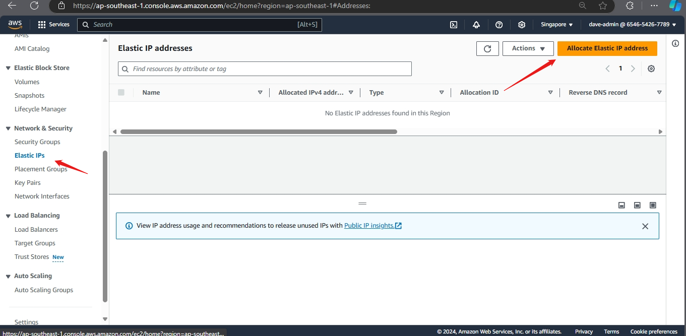

3. Click **Allocate**. You will see a confirmation message, and your new Elastic IP will be displayed.

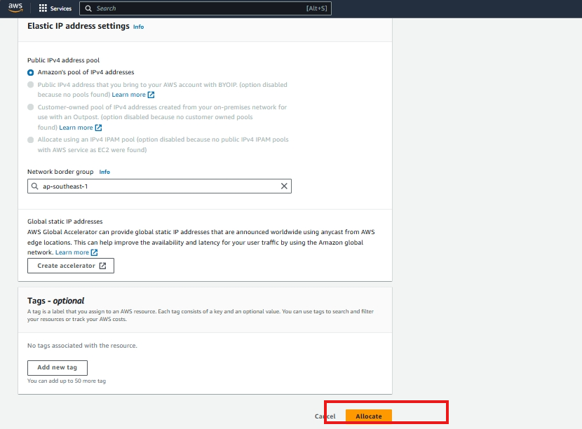

### Step 2: Associate the Elastic IP with an EC2 Instance
1. Select the newly allocated Elastic IP from the list.

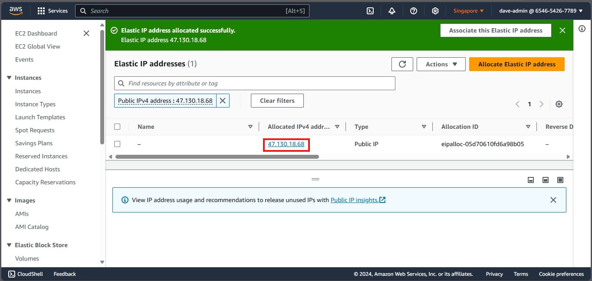

2. Choose **Associate Elastic IP address**.

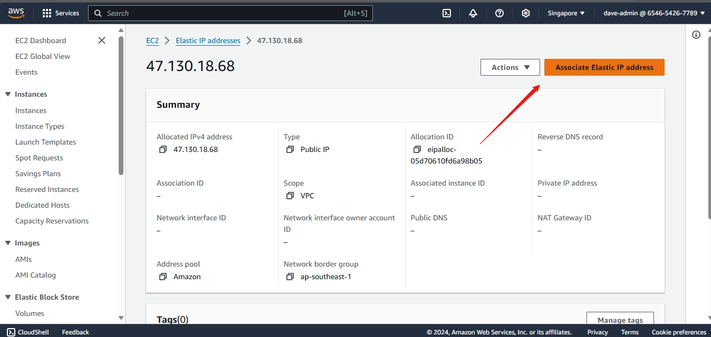

3. In the **Instance** field, start typing the ID or name of your EC2 instance and select it from the dropdown.

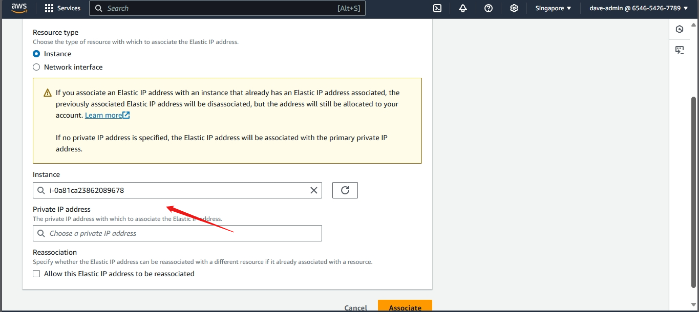

4. Leave the **Private IP address** field as default unless you have specific configurations.
5. Click **Associate**.

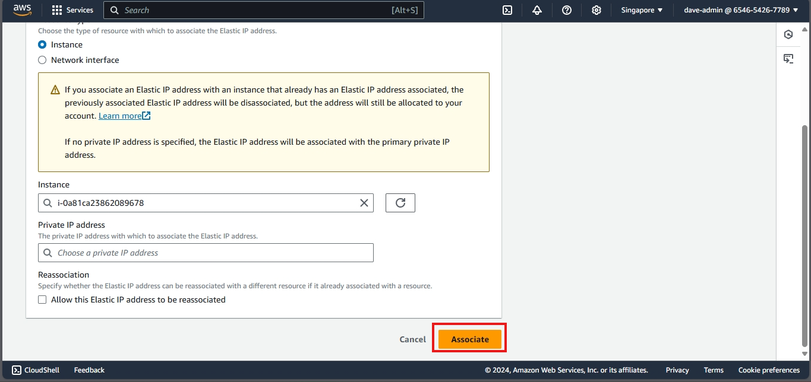

### Step 3: Verify the Association
1. Navigate back to the **Instances** section in the EC2 dashboard.
2. Select your EC2 instance and scroll down to the **Description** tab.
3. Verify that the **Elastic IP** is now listed under the instance's public IP address.
  
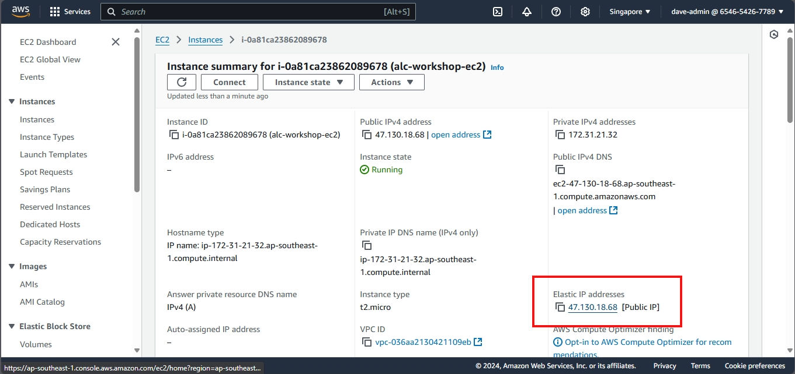

### Step 4: Test the Elastic IP using web browser.
1. Open a web browser.
2. Enter the Elastic IP address in the address bar.
3. If a web server is running on your instance, you should see the expected response.

### Step 5: Testing the Elastic IP by comparing it with the Public IP

- The public IP address of an EC2 instance can change when the instance is stopped and started, while an Elastic IP remains the same until you release it.

#### Testing the Public IP

1. Find an instance with a public IP address. (without an Elastic IP)

2. Check the public IP address of the instance.

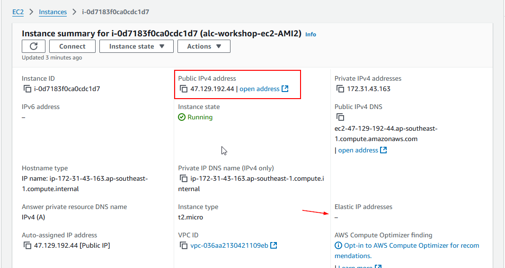

`47.129.192.44` is the public IP address of the instance.

3. Stop the instance.

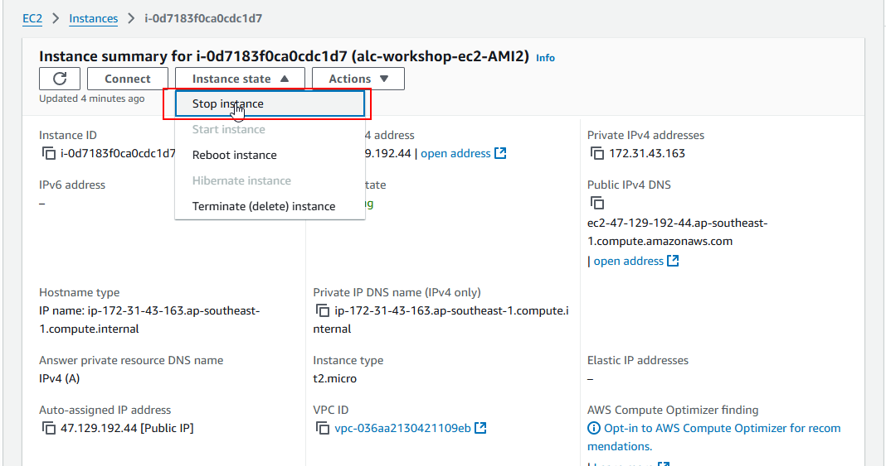

4. Start it again and watch the public IP address change.

#### Testing the Elastic IP

1. Find the instance with an Elastic IP address.

2. Stop the instance.

3. Start it again and check the Elastic IP address. It should remain the same.

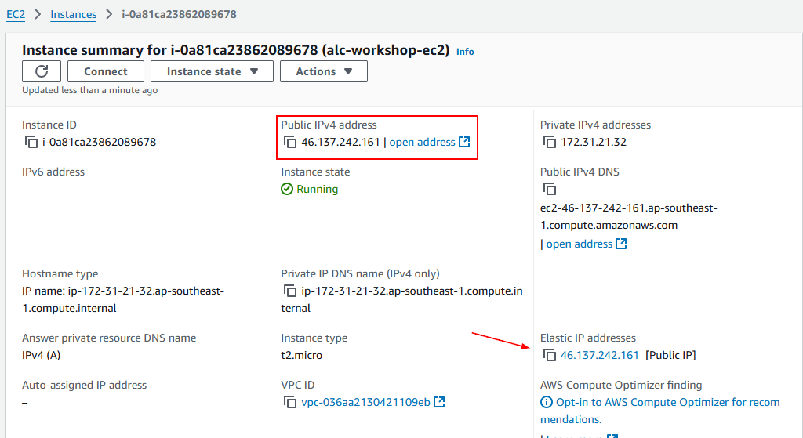

## Cleanup
1. If you no longer need the Elastic IP, go back to the **Elastic IPs** section.
2. Select the Elastic IP and choose **Disassociate Elastic IP address** from the **Actions** dropdown.

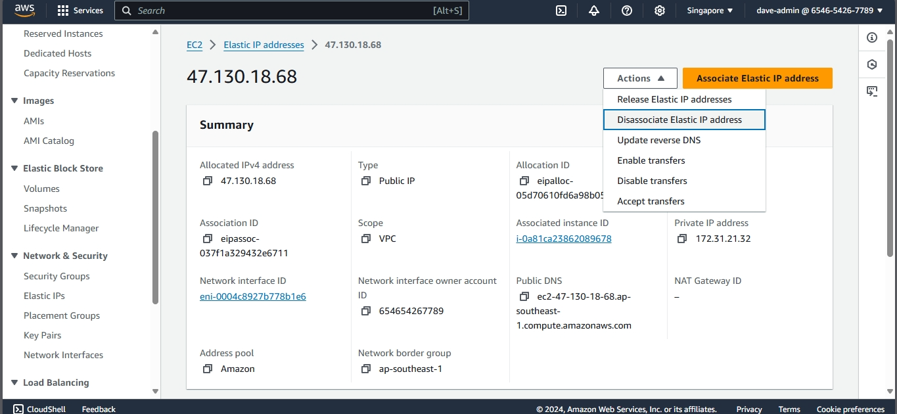

3. Release the Elastic IP by selecting **Release Elastic IP address** from the **Actions** dropdown.

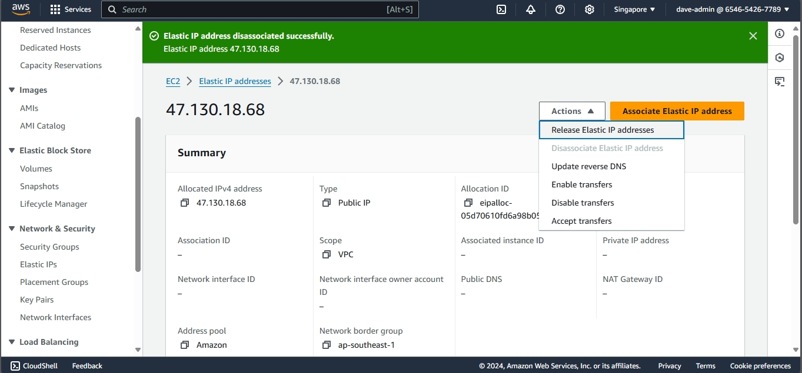

4. Confirm the release.

## Additional Resources
- [Elastic IP Addresses](https://docs.aws.amazon.com/AWSEC2/latest/UserGuide/elastic-ip-addresses-eip.html)

