# Workshop: Expanding an EBS Volume in AWS

## Step 1: Modify the EBS Volume in the AWS Console

1. Select the instance where we want to expand the EBS volume.

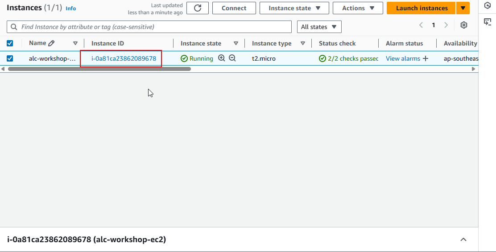

2. Scroll down to the storage section and click on the EBS volume.

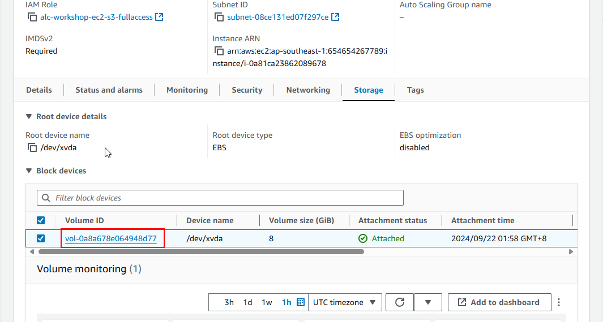

3. Click the EBS volume ID to view its details.

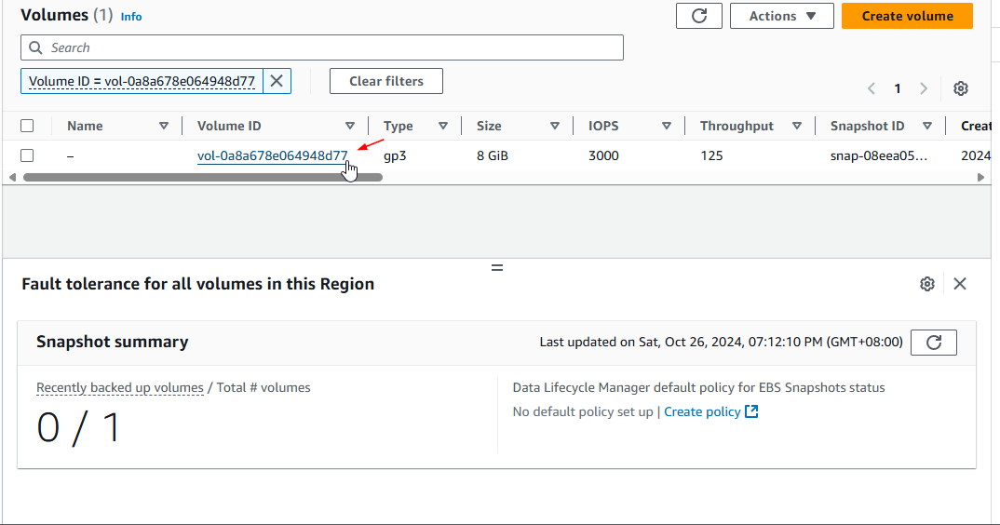

4. Click the **Modify** button.

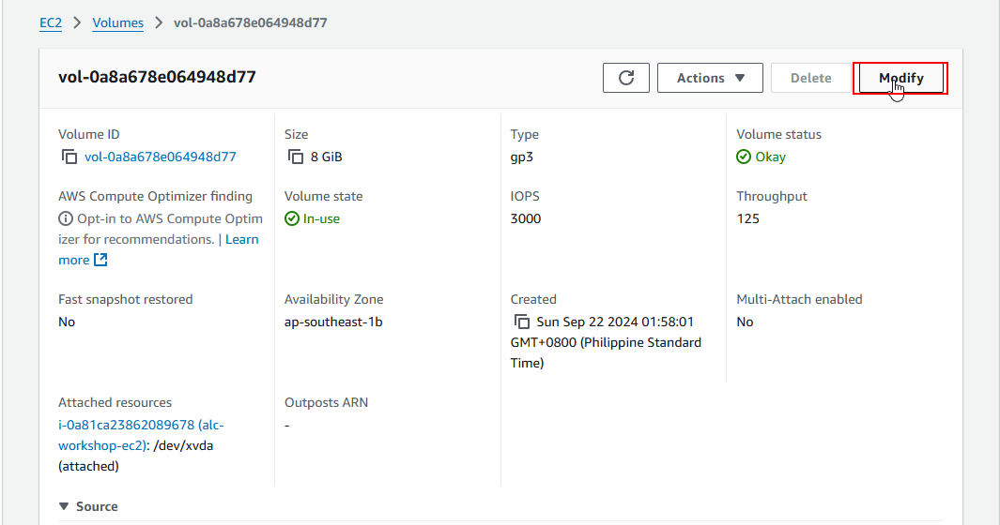

5. Moify the volum size from `8 GiB` to `12 GiB` and click **Modify**.

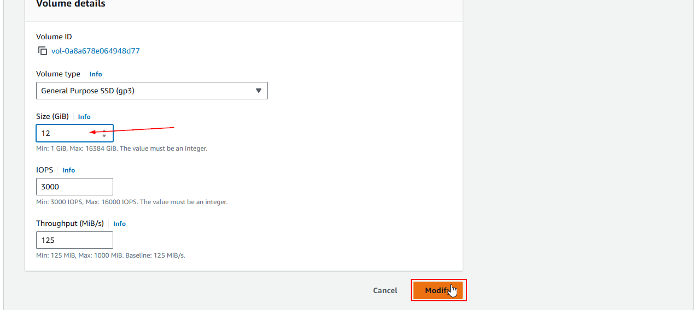

6. **Wait for Update**:
   - AWS will modify the volume in the background. You can monitor the **State** in the **Volumes** section until it shows as **available**.


---

## Step 2: Reflect the Changes on the EC2 Instance Using AWS CLI

1. **Verify the New Size on the Instance**:
   - SSH into your EC2 instance.

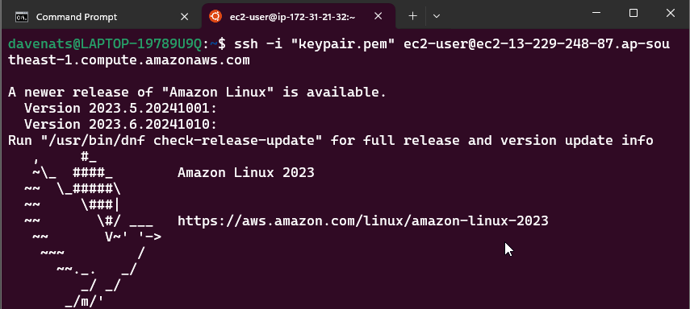

   - Check if the OS recognizes the new volume size:
  
     ```bash
     lsblk
     ```

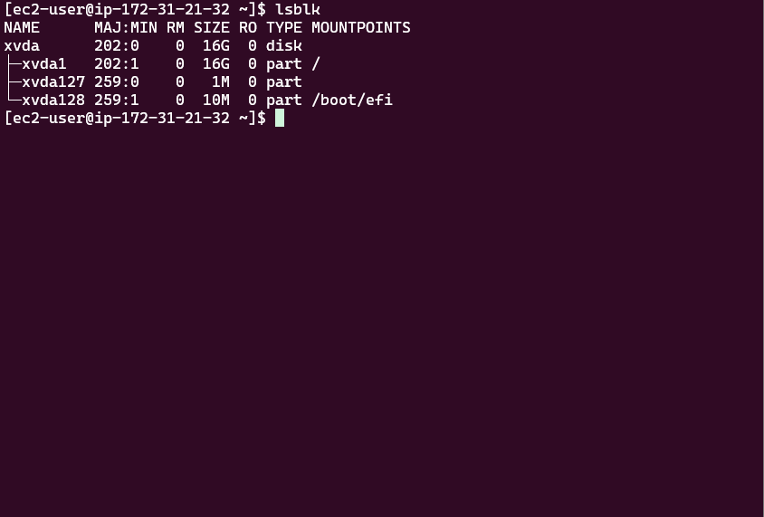

   - Lets use to see the file system type:
  
      ```bash
      lsblk -f 
      ``` 
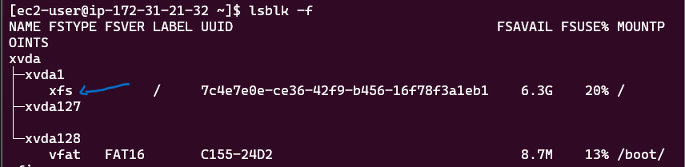

From the output, we can see that the file system type is `xfs`.

2. **Resize the partition**
   
```
sudo growpart /dev/xvda 1
```


This command will resize the storage partition to the maximum size available.

3. **Expand the File System**:
   - Run the following commands based on the file system type.

   - For **ext2/ext3/ext4** file systems:
     ```bash
     sudo resize2fs /dev/xvdf
     ```

   - For **XFS** file systems, the same one that we had in the instance:
     ```bash
     sudo xfs_growfs -d /mount/point
     ```
   
   - Replace `/dev/xvdf` and `/mount/point` with your specific device name or mount point as listed by `lsblk`. From the output of `lsblk`, you can see the mount point of the volume. Use that mount point in the command. 

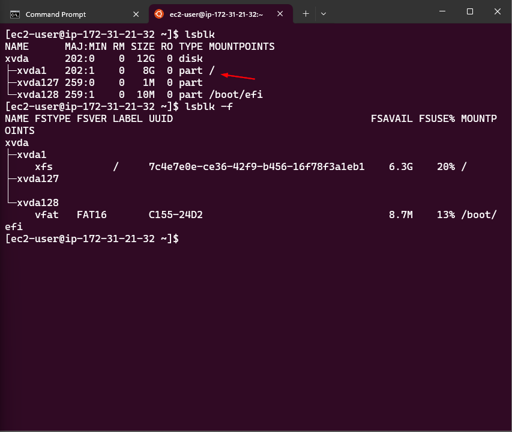


   - Type in the command that suits your file system and press `Enter`. We have a XFS file system in this instance and `/` is the mount point.
   The command is:
   ```bash
   sudo xfs_growfs -d /
   ```

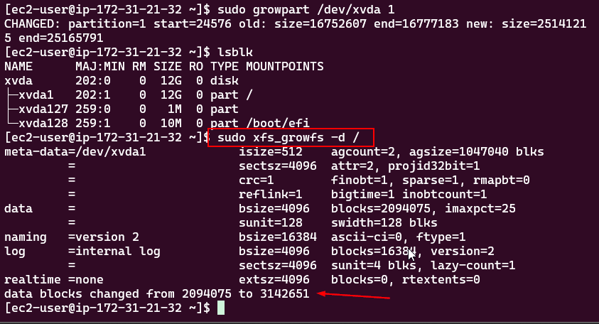


4. **Verify Expansion**:
   - Run `df -h` to ensure the file system reflects the new volume size.

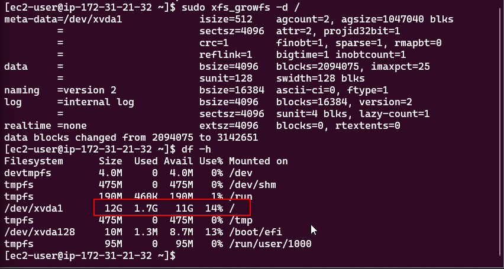

We have successfully expanded the EBS volume and the file system on the EC2 instance.
---

