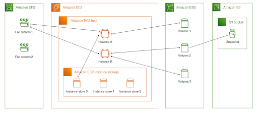
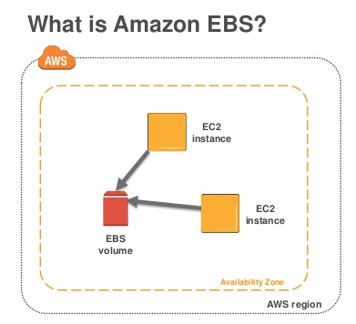
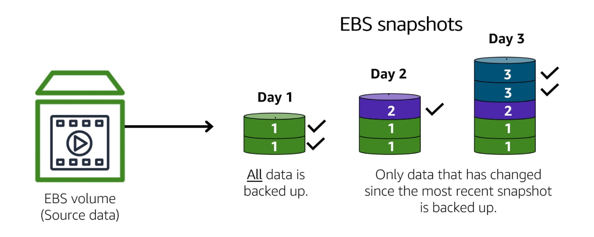

# Storage in EC2
Amazon EC2 provides you with flexible, cost effective, and easy-to-use data storage options for your instances. Each option has a unique combination of performance and durability. These storage options can be used independently or in combination to suit your requirements.

## Block Storage

### Amazon EBS 
Amazon EBS provides durable, block-level storage volumes that you can attach and detach from your instances. 

### Instance store temporary block storage for EC2 instances
Instance store provides temporary block-level storage for instances. The number, size, and type of instance store volumes are determined by the instance type and instance size.

## Object storage

### Amazon S3 
Amazon S3 provides access to reliable and inexpensive data storage infrastructure. It is designed to make web-scale computing easier by enabling you to store and retrieve any amount of data, at any time, from within Amazon EC2 or anywhere on the web.For example, you can use Amazon S3 to store backup copies of your data and applications. Amazon EC2 uses Amazon S3 to store EBS snapshots and instance store-backed AMIs.

## File Storage

### Amazon EFS (Linux instances only)
Amazon EFS provides scalable file storage for use with Amazon EC2. You can create an EFS file system and configure your instances to mount the file system. You can use an EFS file system as a common data source for workloads and applications running on multiple instances.

### Amazon FSx
- With Amazon FSx, you can launch, run, and scale feature-rich, high-performance file systems in the cloud. Amazon FSx is a fully-managed service that supports a wide range of workloads.  You can choose between these widely-used file systems: Lustre, NetApp ONTAP, OpenZFS, and Windows File Server.

## File Caching
Amazon File Cache provides temporary, high-performance cache on AWS for processing file data. The cache provides read and write data access to compute workloads on Amazon EC2 with sub-millisecond latencies, up to hundreds of GB/s of throughput, and up to millions of IOPS.

The following figure shows the relationship between these storage options and your instance.

# EBS

Amazon Elastic Block Store (Amazon EBS) provides scalable, high-performance block storage resources that can be used with Amazon Elastic Compute Cloud (Amazon EC2) instances. With Amazon Elastic Block Store, you can create and manage the following block storage resources:

## Amazon EBS volumes 
These are storage volumes that you attach to Amazon EC2 instances. After you attach a volume to an instance, you can use it in the same way you would use a local hard drive attached to a computer, for example to store files or to install applications.

## Amazon EBS snapshots 
These are point-in-time backups of Amazon EBS volumes that persist independently from the volume itself. You can create snapshots to back up the data on your Amazon EBS volumes. You can then restore new volumes from those snapshots at any time.

# Accessing Amazon EBS
You can create and manage your Amazon EBS resources using the following interfaces:
- AWS Command Line Interface
- AWS Tools for PowerShell
- AWS CloudFormation
- Amazon EC2 Query API
- AWS SDKs

## Pricing
Pricing Calculator - https://calculator.aws/#/createCalculator/EBS 

## Amazon EBS provides the following volume types: 

### General Purpose SSD (gp2 and gp3) and Provisioned IOPS SSD (io1 and io2). 
- SSD-backed volumes are optimized for transactional workloads involving frequent read/write operations with small I/O size, where the dominant performance attribute is IOPS.

### Throughput Optimized HDD (st1), Cold HDD (sc1) 
- HDD-backed volumes are optimized for large streaming workloads where the dominant performance attribute is throughput. HDD volume types include Throughput Optimized HDD and Cold HDD.

### Magnetic (standard). 
- Magnetic (standard) volumes are previous generation volumes that are backed by magnetic drives. They are suited for workloads with small datasets where data is accessed infrequently and performance is not of primary importance. 

## Basic Steps

## Features and benefits of Amazon EBS volumes
- **Data availability.** When you create an EBS volume, it is automatically replicated within its Availability Zone to prevent data loss due to failure of any single hardware component.

- **Data persistence.** An EBS volume is off-instance storage that can persist independently from the life of an instance. You continue to pay for the volume usage as long as the data persists.

- **Data encryption.** For simplified data encryption, you can create encrypted EBS volumes with the Amazon EBS encryption feature. All EBS volume types support encryption. You can use encrypted EBS volumes to meet a wide range of data-at-rest encryption requirements for regulated/audited data and applications.
- **Data security.** 

- **Snapshots.** Amazon EBS provides the ability to create snapshots (backups) of any EBS volume and write a copy of the data in the volume to Amazon S3, where it is stored redundantly in multiple Availability Zones. 
 
- The volume does not need to be attached to a running instance in order to take a snapshot. As you continue to write data to a volume, you can periodically create a snapshot of the volume to use as a baseline for new volumes. 

- These snapshots can be used to create multiple new EBS volumes or move volumes across Availability Zones. Snapshots of encrypted EBS volumes are automatically encrypted.

- When you create a new volume from a snapshot, it's an exact copy of the original volume at the time the snapshot was taken.

- Snapshots are incremental backups, meaning that only the blocks on the volume that have changed after your most recent snapshot are saved. If you have a volume with 100 GiB of data, but only 5 GiB of data have changed since your last snapshot, only the 5 GiB of modified data is written to Amazon S3. 

- Even though snapshots are saved incrementally, the snapshot deletion process is designed so that you need to retain only the most recent

- **Flexibility.** EBS volumes support live configuration changes while in production. You can modify volume type, volume size, and IOPS capacity without service interruptions.

## Volume Lifecycle: Attach an EBS volume to multiple EC2 instances using Multi-Attach
Amazon EBS Multi-Attach enables you to attach a single Provisioned IOPS SSD (io1 or io2) volume to multiple instances that are in the same Availability Zone. You can attach multiple Multi-Attach enabled volumes to an instance or set of instances.

- Multi-Attach makes it easier for you to achieve higher application availability in applications that manage concurrent write operations.

## Pricing and billing

- There are no additional charges for using Amazon EBS Multi-Attach. You are billed the standard charges that apply to Provisioned IOPS SSD (io1 and io2) volumes.
	
## Migrate Amazon EBS volumes from gp2 to gp3
The standard across many AWS services (including Amazon EC2) is gp2. The performance is closely coupled with the size of the volume. For every 1 GB of capacity, gp2 volumes get 3 IOPS of performance. That is, a 2,000 GB gp2 volume is capable of 6,000 IOPS.  The third generation of general purpose SSDs, called gp3. For gp3 volumes, performance can be customized independently from the storage capacity. This enables even small capacity volumes to achieve performance capabilities up to 16,000 IOPS and 1,000 Mb/s throughput.

*Note: IOPS are a unit of measure representing input/output operations per second.*

### Cost Impact
- For gp2 volumes, pricing is based on provisioned capacity at $0.10 per GiB-month. For gp3 volumes, have a capacity price at $0.08 per GiB-month (20 percent less expensive than gp2) and separate costs for IOPS at $0.005 per provisioned IOPS-month over 3,000 and $0.04 per provisioned MiBs-month over 125 MiBs for throughput.

## Modify Amazon EBS snapshots

Deleting EBS volumes and managing the retention and archiving of snapshots is an important aspect to control costs from the start. You can back up the data on your EBS volumes to Amazon Simple Storage Service (Amazon S3) by taking point-in-time snapshots. 

- Snapshots are incremental backups, so they save only the blocks on the devices that changed after your most recent snapshot. This minimizes the time required to create the snapshot and saves on storage costs by not duplicating data.

- Each snapshot contains all the information that's required to restore your data (from when the snapshot was created) to a new EBS volume.

Charges for EBS snapshots are calculated by the gigabyte-month. You're billed for how large the snapshot is and how long you keep the snapshot. Pricing varies depending on the storage tier. 

- **Standard tier –** You have a volume that's storing 100 GB of data. You're billed for the full 100 GB of data for the first snapshot (snap A). At the time of the next snapshot (snap B), you have 105 GB of data. You're then billed for only the additional 5 GB of storage for incremental snap B.
- **Archive tier –** You archive snap B. The snapshot is then moved to the Archive tier, and you're billed for the full 105 GB snapshot block.

### Cost Impact
- Charges for EBS volumes and snapshots are managed separately. The following table compares the standard and archive tiers per month at just 50 TB of usage. Even at this lower scale it's still thousands of dollars of savings annually.

## Delete unattached Amazon EBS volumes
Unattached (orphaned) EBS volumes can lead to unnecessary storage costs in your AWS environment.
- ***It's a best practice to have a process in place to continually review the usage of EBS volumes.***

### Cost impact
- Unattached EBS volumes, also referred to as unused or orphaned volumes, incur the same charges as attached volumes based on the provisioned storage size and storage type. Although it's only 0.10 per GB-month, it's crucial to recognize that the accumulation of unused EBS volumes can result in significant costs over time.

## Cost optimization recommendations

You can use AWS to easily automate the deletion of unattached EBS volumes. 

- For example, use AWS Lambda, AWS Config, Amazon CloudWatch, and AWS Systems Manager to define criteria for deleting unattached volumes based on age, tags, and other specifications. 

- You can also use these AWS services to automate the cleanup process at scale.

## Amazon EBS Volume Lifecycle

## Elastic File System (EFS)
Amazon EFS provides scalable file storage for use with Amazon EC2. You can use an EFS file system as a common data source for workloads and applications running on multiple instances. 

- EFS is a fully managed, scalable, elastic file storage service that can be shared across multiple EC2 instances.

- It is designed to provide a simple, scalable, and fully managed file storage solution for use with AWS Cloud services and on-premises resources.

How it works:
Amazon Elastic File System (Amazon EFS) automatically grows and shrinks as you add and remove files with no need for management or provisioning.

Features:
- **File System Storage:** EFS provides a file system interface and file system semantics, meaning you can access files in a directory structure (like a traditional file system).

- **Shared Access:** Multiple EC2 instances can access the same EFS file system simultaneously, making it ideal for applications that require shared access to files, such as content management systems, web servers, and data analytics.

- **Automatic Scaling:** EFS automatically scales up or down as files are added or removed, so you only pay for what you use.

- **Performance Modes:** Supports two performance modes (General Purpose and Max I/O) for various performance requirements.

- **Durability:** Data is redundantly stored across multiple Availability Zones, ensuring high availability and durability.

## EBS Lifecycle Manager

You can use Amazon Data Lifecycle Manager to automate the creation, retention, and deletion of EBS snapshots and EBS-backed AMIs. 

- EBS Data Lifecycle Manager (DLM) is an automation tool that helps manage the lifecycle of your EBS volumes and snapshots. It allows you to define policies that automatically create, retain, and delete EBS snapshots and volumes according to your specified criteria.
**Quotas**
Your AWS account has the following quotas related to Amazon Data Lifecycle Manager:

## **Features:**
- **Automation:** Set up rules to automatically create snapshots or delete old ones based on age or other factors.

- **Cost Management:** Ensure that you only keep the snapshots or volumes you need, helping you optimize storage costs.

- **Compliance:** Retain snapshots according to your compliance or data retention requirements.

- **Retention Policies:** Specify how many snapshots to keep, and automatically delete older ones when a new one is created.