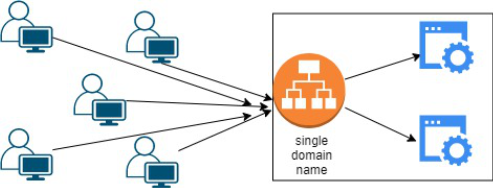
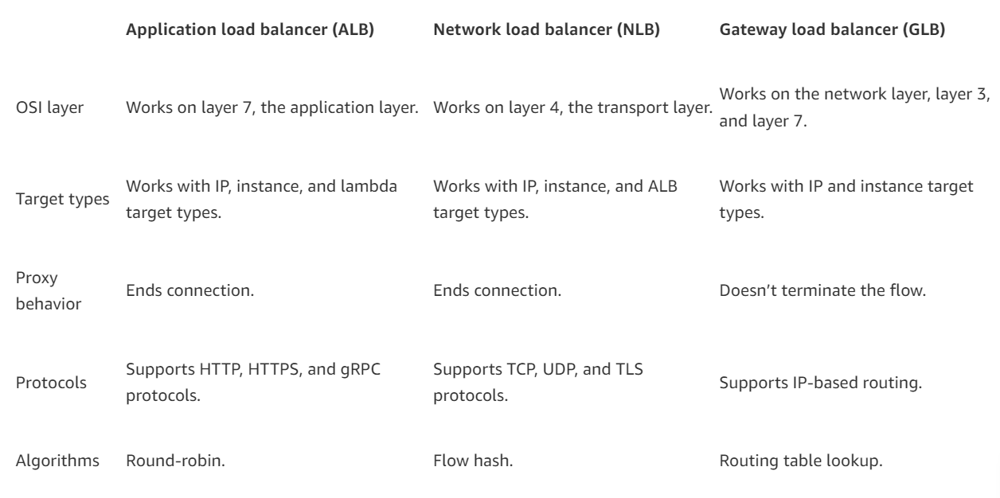
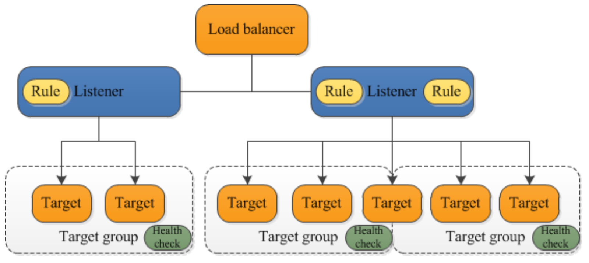

# What is Elastic Load Balancing?

**Elastic Load Balancing** distributes incoming traffic among different targets, it includes EC2 instances, containers, and IP addresses, in one or more Availability Zones. It checks the health of the registered targets and directs traffic simply to the healthy targets. Elastic Load Balancing automatically adjusts load balancer capacity in response to fluctuations in incoming traffic.

### BENEFITS/SIGNIFICANCE of Elastic Load Balancing
- **Increased Availability**: By dividing traffic over multiple EC2 instances, it ensures high availability while reducing downtime during peak demand.
- **Fault Tolerance**: It proactively detects unhealthy instances and reroutes traffic to improve application fault tolerance.
- **Scalability**: It dynamically changes resources based on traffic when it is used with Auto Scaling providing peak performance without any user intervention.
- **Improved Performance**: The load is divided evenly across instances to avoid delays and ensure constant response times.

---
## Types of Load Balancers
AWS offers different types of load balancers for specific use cases. There are three main types: **Application Load Balancer**, **Network Load Balancer**, and **Gateway Load Balancer**.
### 1. Application Load Balancer (ALB)
- Use case: Best for web applications.
- Layer: Operates at Layer 7 (Application Layer).
- How it works: The ALB routes traffic based on the content of the request, such as URL paths or HTTP headers. This makes it ideal for applications that need intelligent routing, such as microservices or container-based apps.

### 2. Network load balancer (NLB)
- Use case: Ideal for high-performance applications requiring TCP/UDP traffic or low latency.
- Layer: It operates at Layer 4 (Transport Layer).
- How it works: The NLB directs traffic using IP addresses and ports. It is intended for high performance and can handle millions of requests per second with little latency. It works well for apps that do not need to assess the request's content.

### 3. Gateway Load Balancer (GWLB)
- Use case: Ideal for combining virtual appliances from third parties, such as intrusion detection systems (IDS), firewalls, and other security appliances.
- Layer: Utilizes the Network Layer, or Layer 3.
- How it works: It integrates virtual appliances into the network by placing the GWLB in between network and the appliances. Traffic is sent to the appliances for logging, filtering, or inspection, and then it is forwarded back to the original destination.

The **main differences** between load balancer types
- **ALB**: Works best for HTTP/HTTPS applications that require traffic routing according to the content of the requests.
- **NLB**: Optimal for applications requiring high speed and low latency while managing high TCP/UDP traffic volumes.
- **GLB**: Ideal for adding surveillance or security appliances, such as firewalls and threat detection systems to the network.

## Components of a basic Application Load Balancer

+ Load balancer
+ Listener
+ Target Group

**Listener**:
A **listener** is a process that monitors the set protocol and port for connection requests. It needs at least one listener before using application load balancer. If a load balancer does not have listeners, it will be unable to receive client traffic. The load balancer routes requests to the register targets, such as EC2 instances, depending on the rules provided for listeners.

**Target Groups** for Application Load Balancers:
Application load balancers (ALBs) use **target groups** to direct requests to certain resources, such as EC2 instances. Every target group has a defined protocol and port assigned to it. By controlling the distribution of requests across the resources, target groups contribute to effective and balanced traffic routing. It maximizes the dependability and performance of the application by properly establishing them.

## How does application load balancer work?

1. A client/user sends a request to the load balancer, which serves as the application's main point of access.

2. Initially, the listener on the load balancer checks the incoming request, using the protocol and port that was configured.

3. The listener then prioritizes its rules to decide which one fulfills the request's requirements.

4. Following that, the load balancer picks a target group to route the request to based on the rule action.

5. Within the defined target group, the load balancer selects a specific target using a routing strategy. Round robin is the default routing method, however it may alternatively select the routing algorithm that has the fewest outstanding requests.

6. The load balancer then runs a health check to confirm that the specified target is working.

7. Afterward, the load balancer forwards the request to the specified healthy target. If the target is considered unhealthy, the load balancer selects another healthy target.

8. Lastly, the target processes the request and sends a response to the load balancer, which forwards it to the client.

## Key Features

**Rules** are used to indicate the target group to deliver traffic depending on predefined circumstances for the load balancer's listener. Making routing effective and flexible possible.

Each target group may register a target with more than one load balancer, but each load balancer may only be connected to a single target group.

**Routing Requests**: Traffic can be directed to one or more registered targets by each target group. Various target groups can be made for various kinds of requests, including:

- General requests
- Microservice requests
- Health Checks

---
## Why test load balancer instances?

A load balancer is tested to ensure that **traffic is distributed across servers correctly**, problems are managed in the case of a server failure and configurations such as routing and health checks are up to order.

Elastic Load Balancer **automatically stops forwarding requests** to an unhealthy instance when it fails health checks. This keeps the application from experiencing problems or delays by guaranteeing that traffic is only sent to instances that are stable and operating. The load balancer returns sending traffic to the instance when it passes health checks again.

---

## Monitoring Health of Each Instance
-
An Elastic Load Balancer only routes traffic to healthy targets, such as EC2 instances, containers, IP addresses, microservices, Lambda functions, and appliances.

**Health Checks**: These checks are usually set up to display specific error codes when something goes wrong and to monitor every service operating behind the load balancer. This aids in promptly locating and resolving problems.

---

## EC2 Load Balancing Pricing

AWS charges for load balancers depending on two key factors: **hours utilized** and **capacity units consumed**.

### Application Load Balancers (ALB)

Hourly charge: Charged for each hour (or partial hour) while the load balancer is operational, regardless of the amount of traffic it manages.

LCU (Load Balancer Capacity Unit): In addition to the hourly fee, it is charged according to the number of LCUs utilized every hour.

The LCUs measure:
- New connections (the number of new requests)
- Active connections (ongoing traffic)
- Data processed (total number of bytes transmitted).

### Network load balancer (NLB)

Hourly charge: Like ALB, it is charged for each hour (or partial hour) while the NLB is operational.
NLCU (Network Load Balancer Capacity Unit): Charges vary depending on how many NLCUs are utilized per hour. NLCUs measure:
- Bandwidth ( the amount of data transmitted)
- New and active connections (the number of connections formed or maintained),
- TLS termination (if the load balancer is handling encrypted connections).

### Gateway Load Balancer(GWLB)
Hourly charge: charges for every hour (or partial hour) that the GWLB is operational.

GLCU (Gateway Load Balancer Capacity Unit): Charges depend on the number of GLCUs used per hour, which measure traffic passing through the gateway.

Gateway Load Balancer Endpoint: A separate service used to securely exchange traffic across VPCs, and it is billed separately from the GWLB.

### AWS Load balancer Free Tier

Use the AWS Free Tier to begin using elastic load balancing for **free**. New AWS users get **15 GB** of data processing for Classic load balancers and 15 LCUs for Application load balancers upon signup, along with **750 hours per month** split between Classic and Application load balancers.

