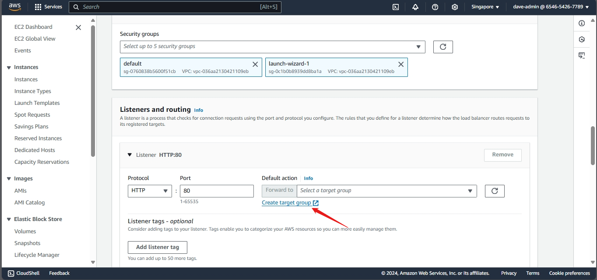
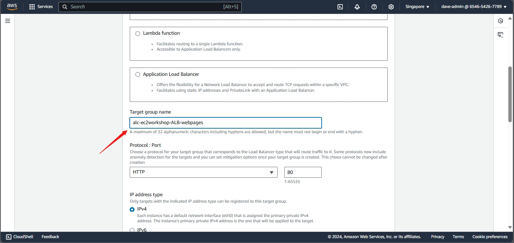
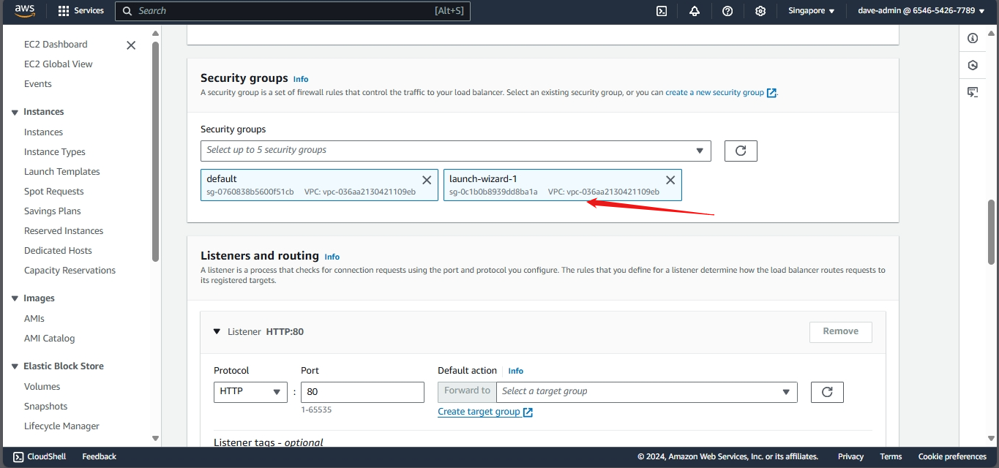
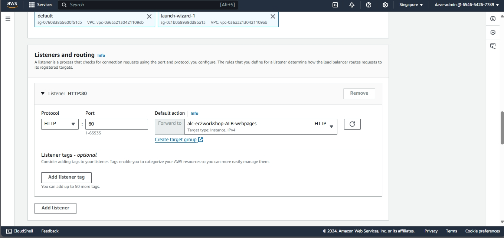

# Configuring an Elastic Load Balancer with Multiple Instances

This part will walk you through the process of setting up an Elastic Load Balancer (ELB) with three EC2 instances that provide slightly different outputs. This setup will help demonstrate how load balancing works by distributing traffic across the instances.

## Step 1: Prepare 3 instances

- We already made three from our `What is AMI and Images?` part.


## Step 2: Create a target group

 1. **Create Target Group**:
 - Create a new target group for the instances.
 - Select "Instance" as the target type.
 - Add all three instances to the target group.





  

click `Include as pending below`


  

You have now created a target group with three instances. The next step is to create a load balancer and configure it to use this target group.

## Step 2: Configure the Elastic Load Balancer

1. **Navigate to Load Balancers**:
   - In the EC2 Dashboard, click on "Load Balancers" under "Load Balancing".


2. **Create Load Balancer**:
   - Click on "Create Load Balancer" and select "Application Load Balancer".


3. **Configure Load Balancer**:
   - **Name**: Enter a the name `alc-ec2workshop-ALB`
   - **Scheme**: Select "Internet-facing".


   - **VPC and Subnets**: Choose the same VPC and select all availability zones where your instances are located. 


     - To check the availability zone of your instances:
     - Go back to the instace page and check the availability zone of the instances


  


4. **Select Security Group**:
   - Choose the security group that applies to all instances.




5. **Listeners and Routing**:
   - Leave the default listener set to port 80 (HTTP).

6. **Configure Routing**:
   - Select the target group you created earlier.




7. **Launch the Load Balancer**:
   - Review the settings and click "Create".


## Step 3: Test the Load Balancer

1. **Obtain Load Balancer DNS**:
   - Once the load balancer is created, obtain its DNS name from the Load Balancers section.


2. **Access the Load Balancer**:
   - Open a web browser and enter the DNS name of the load balancer.
   - Refresh the page multiple times to see the different instance outputs:
     - Instance 1


     - Instance 2


     - Instance 3


## Step 4: Monitor Load Balancer and Instances

1. **Check Target Group Health Status**:
   - Select the target group associated with your instances.


   - Check the health status of each instance to ensure they are properly registered and healthy.


## Creating a Load Balancer with Multiple Instances using AWS CLI

- Lets go back to AWS ClI. Make sure to copy all your ARN's and ID's as we will be using them in the following steps. You can use notepad or any other text editor to store them.

1. **Create a Target Group**:
   - Use the `create-target-group` command to create a target group with the desired settings.

```bash
aws elbv2 create-target-group \
    --name <target-group-name> \
    --protocol HTTP \
    --port 80 \
    --vpc-id <your-vpc-id> \
    --health-check-protocol HTTP \
    --health-check-path / \
    --target-type instance
```
   - Note: Replace `<your-vpc-id>` with your VPC ID. Use the following command to get your VPC ID:

```bash
aws ec2 describe-vpcs 
```


- In my case, the VPC ID is `vpc-036aa2130421109eb`. My command is a follows:

```bash
aws elbv2 create-target-group \
    --name alc-workshop-ec2-TG \
    --protocol HTTP \
    --port 80 \
    --vpc-id vpc-036aa2130421109eb \
    --health-check-protocol HTTP \
    --health-check-path / \
    --target-type instance
```


- Lets check the target group we created:

```bash
aws elbv2 describe-target-groups
```


2. **Register Instances with the Target Group**:
   - Use the `register-targets` command to register the instances with the target group.
  

```bash
aws elbv2 register-targets \
    --target-group-arn <your-target-group-arn> \
    --targets Id=<instance-id-1> Id=<instance-id-2> Id=<instance-id-3>
```

- We have our target group ARN from the previous command. (`aws elbv2 describe-target-groups`). In my case, the ARN is `arn:aws:elasticloadbalancing:ap-southeast-1:654654267789:targetgroup/alc-workshop-ec2-TG/64d292c1d82539e6`.


- We also have the instance IDs from the previous command. (`aws ec2 describe-instances`)

```bash
aws ec2 describe-instances \
    --filters "Name=instance-state-name,Values=running" \
    --query "Reservations[*].Instances[*].[InstanceId,InstanceType,State.Name,PublicIpAddress,Placement.AvailabilityZone,Tags[?Key=='Name'].Value | [0]]" \
    --output table
```


- All in all, my command is as follows:

```bash
aws elbv2 register-targets \
    --target-group-arn arn:aws:elasticloadbalancing:ap-southeast-1:654654267789:targetgroup/alc-workshop-ec2-TG/64d292c1d82539e6 \
    --targets Id=i-0a81ca23862089678 Id=i-0d7f6a5786ef1d096 Id=i-07626272de0252a99
```

- Lets check the target group we created:

```bash
aws elbv2 describe-target-health \
    --target-group-arn arn:aws:elasticloadbalancing:ap-southeast-1:654654267789:targetgroup/alc-workshop-ec2-TG/64d292c1d82539e6 \
    --query "TargetHealthDescriptions[*].[Target.Id, TargetHealth.State, TargetAvailabilityZone]" \
    --output table
```


- As you notice both the target health and the target availability zone are none. This is because we still have to create the load balancer.

3. **Create a Load Balancer**:
   - Use the `create-load-balancer` command to create a load balancer with the desired settings.

```bash
aws elbv2 create-load-balancer \
    --name <load-balancer-name> \
    --subnets <subnet-id-1> <subnet-id-2> \
    --security-groups <security-group-id> \
    --scheme internet-facing \
    --type application \
    --ip-address-type ipv4
```

- We first need to get the subnet ID's. Use the following command:

```bash
aws ec2 describe-instances \
    --query "Reservations[*].Instances[*].[InstanceId, SubnetId, Placement.AvailabilityZone]" \
    --output table
```


- Now we need to get the security group ID. Use the following command, In this case, the security group ID is `sg-0c1b0b8939dd8ba1a`.:

```bash
aws ec2 describe-security-groups
```


- All in all, my command is as follows:

```bash
aws elbv2 create-load-balancer \
    --name my-app-load-balancer \
    --subnets subnet-08ce131ed07f297ce subnet-0dde1c2d70e916cb2 \
    --security-groups sg-0c1b0b8939dd8ba1a \
    --scheme internet-facing \
    --type application \
    --ip-address-type ipv4
```

- Notice that I only have one subnet ID. This is because I only have one availability zone in my 3 instances. I added one because load balancers require at least two subnets in two different availability zones.


4. **Create a Listener**:
   - Use the `create-listener` command to create a listener for the load balancer.

```bash
aws elbv2 create-listener \
    --load-balancer-arn <your-load-balancer-arn> \
    --protocol HTTP \
    --port 80 \
    --default-actions Type=forward,TargetGroupArn=<your-target-group-arn>
```
- My load balancer ARN is `arn:aws:elasticloadbalancing:ap-southeast-1:654654267789:loadbalancer/app/my-app-load-balancer/a240fe5ee9785a79`
- My target group ARN is `arn:aws:elasticloadbalancing:ap-southeast-1:654654267789:targetgroup/alc-workshop-ec2-TG/64d292c1d82539e6`

- All in all, my command is as follows:

```bash
aws elbv2 create-listener \
    --load-balancer-arn arn:aws:elasticloadbalancing:ap-southeast-1:654654267789:loadbalancer/app/my-app-load-balancer/a240fe5ee9785a79 \
    --protocol HTTP \
    --port 80 \
    --default-actions Type=forward,TargetGroupArn=arn:aws:elasticloadbalancing:ap-southeast-1:654654267789:targetgroup/alc-workshop-ec2-TG/64d292c1d82539e6
```


5. **Lets verify the load balancer we created:**

```bash
aws elbv2 describe-load-balancers --names my-app-load-balancer
```


6. **Lets verify the listener we created:**

```bash
aws elbv2 describe-target-health \
    --target-group-arn arn:aws:elasticloadbalancing:ap-southeast-1:654654267789:targetgroup/alc-workshop-ec2-TG/64d292c1d82539e6 \
    --query "TargetHealthDescriptions[*].[Target.Id, TargetHealth.State, TargetAvailabilityZone]" \
    --output table
```


- As you can see, the target health. This means that the load balancer is now working.

7. **Access the Load Balancer**:
   - Open a web browser and enter the DNS name of the load balancer.


   - Refresh the page multiple times to see the different instance outputs.


Note:
- If you want to attach a domain name to the load balancer, you can use Route 53 to create an alias record that points to the load balancer's DNS name.

Link: https://docs.aws.amazon.com/elasticloadbalancing/latest/classic/using-domain-names-with-elb.html

#### Cleanup
- Remove the load balancer and target group to avoid incurring additional costs if you no longer need them.