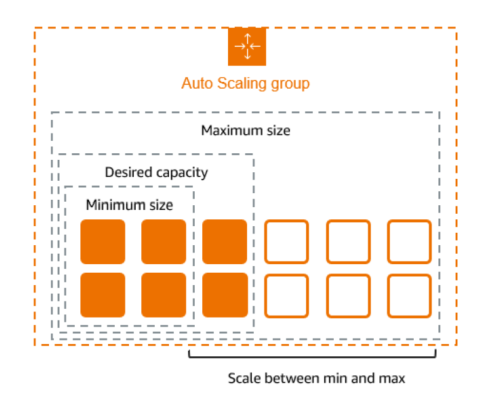
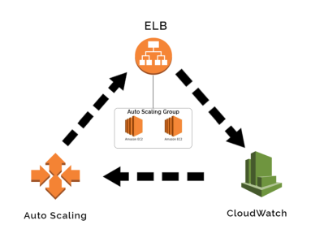
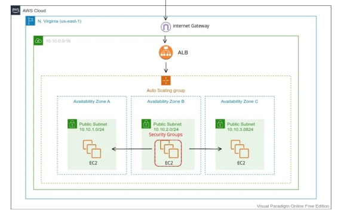
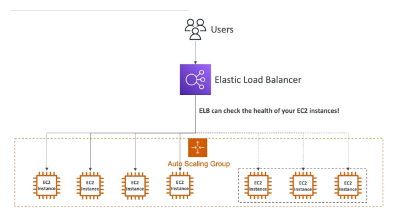

# Auto Scaling Groups

Amazon EC2 Auto Scaling helps you ensure that you have the correct number of Amazon EC2 instances available to handle the load for your application. You create collections of EC2 instances, called Auto Scaling groups. 
- You can specify the minimum and maximum number of instances in each Auto Scaling group, and Amazon EC2 Auto Scaling ensures that your group never goes beyond this size.
-  If you specify the desired capacity, either when you create the group or at any time thereafter, Amazon EC2 Auto Scaling ensures that your group has this many instances.
- If you specify scaling policies, then Amazon EC2 Auto Scaling can launch or terminate instances as demand on your application increases or decreases.

## Example

## Pricing for Amazon EC2 Auto Scaling

There are **no additional fees** with Amazon EC2 Auto Scaling, so it's easy to try it out and see how it can benefit your AWS architecture. You only pay for the AWS resources (for example, EC2 instances, EBS volumes, and CloudWatch alarms) that you use.

**Work with Auto Scaling groups**

You can create, access, and manage your Auto Scaling groups using any of the following interfaces:
- AWS Management Console 
- AWS Command Line Interface (AWS CLI) 
- AWS SDKs
- Query API
- AWS CloudFormation

## Create a launch template for an Auto Scaling group
Before you can create an Auto Scaling group using a launch template, you must create a launch template that contains the configuration information to launch an instance, including the ID of the Amazon Machine Image (AMI). To create new launch templates, use the following procedures.

- Create your launch template (console)
- Change the default network interface settings (console)
- Modify the storage configuration (console)
- Create a launch template from an existing instance (console)
- Related resources
- Limitations

## Create Auto Scaling groups using launch templates
If you have created a launch template, you can create an Auto Scaling group that uses a launch template as a configuration template for its EC2 instances. The launch template specifies information such as the AMI ID, instance type, key pair, security groups, and block device mapping for your instances. 

## Create Auto Scaling groups using launch configurations
If you have created a launch configuration or an EC2 instance, you can create an Auto Scaling group that uses a launch configuration as a configuration template for its EC2 instances. The launch configuration specifies information such as the AMI ID, instance type, key pair, security groups, and block device mapping for your instances. For information about creating launch configurations,

The following describes how to create a launch configuration.After you create a launch configuration, you cannot modify it. Instead, you must create a new launch configuration.

- Create a launch configuration
- Configure the instance metadata options
- Create a launch configuration using an EC2 instance

## Choose your scaling method
Amazon EC2 Auto Scaling provides several ways for you to scale your Auto Scaling group.

***Maintain a fixed number of instances***
- The default for an Auto Scaling group is to not have any attached scaling policies or scheduled actions, which causes it to maintain a fixed size. After you create your Auto Scaling group, it starts by launching enough instances to meet its desired capacity. 

- If there are no scaling conditions attached to the group, it continues to maintain its desired capacity even if an instance becomes unhealthy. 

Amazon EC2 Auto Scaling monitors the health of each instance in your Auto Scaling group. When it finds that an instance has become unhealthy, it replaces it with a new instance. You can read a more in-depth description of this process in Health checks for instances in an Auto Scaling group.

### **Scale manually**

- Manual scaling is the most basic way to scale your Auto Scaling group. You can either update the desired capacity of the Auto Scaling group or terminate instances in the Auto Scaling group. 
- Manual scaling is an alternative to auto scaling, especially if you want to make one-time capacity changes.
- After you manually scale your group, Amazon EC2 Auto Scaling resumes normal auto scaling activities based on the scaling policies and scheduled actions that you defined. For groups with default instance warmup enabled, any new instances go through a warmup period before they start contributing to the metrics used for auto scaling. This warmup period assists in stabilizing the group at the new capacity. 

### **Scale based on a schedule**
- Scaling by schedule means that scaling actions are performed automatically as a function of date and time. 
- This is useful when you know exactly when to increase or decrease the number of instances in your group, simply because the need arises on a predictable schedule. 

### **Scale dynamically based on demand**
A more advanced way to scale your resources, using dynamic scaling, lets you define a scaling policy that dynamically resizes your Auto Scaling group to meet changes in demand.

  
  
***Fig. Dynamic AWS EC2 Autoscaling***

### **Scale proactively**
- You can also combine predictive scaling and dynamic scaling (proactive and reactive approaches, respectively) to scale your EC2 capacity faster. 
- Use predictive scaling to increase the number of EC2 instances in your Auto Scaling group in advance of daily and weekly patterns in traffic flows. 

## How does EC2 Auto Scaling work?

***Fig. How to Build an Auto-scaling Group of AWS EC2 Instance***

When configuring EC2 Auto Scaling, you’ll need to follow these basic steps in the AWS console.

### **Step #1: Draft a Launch Template**
- Launch Templates in Amazon EC2 define the settings for launching instances. It contains the ID of the Amazon Machine Image (AMI), the instance type, a key pair, security groups, and other parameters used to launch EC2 instances. 
- This replaces the legacy Launch Configuration option, while adding additional features.

### **Step #2: Set up Auto Scaling Groups:**
- Auto Scaling Groups are logical collections of EC2 instances, used to manage how instances are scaled out or in using Launch Templates / Launch Configurations. Once the Launch Template defines what to scale, the ASG determines where to launch the EC2 instances.
- You can specify the initial, minimum, maximum, and preferred number of instances.

### **Step #3: Implement Elastic Load Balancer**
ELBs help evenly distribute incoming traffic among Amazon EC2 instances within your Auto Scaling groups as they scale up and down. And when an EC2 instance fails, the load balancer can reroute traffic to the next available healthy EC2 instance.

### **Step #4: Set Auto Scaling Policies**
- Scaling policies dictate how and when the ASG should scale up or down. For example, a policy might be to scale out (add instances) when CPU utilization exceeds 80% for a period and to scale in (remove instances) when it drops below 30%.
- An advanced scaling configuration might consist of scaling policies tracking multiple targets and/or step scaling policies for coverage of various scenarios.

## **Challenges of using EC2 Auto Scaling**

EC2 Auto Scaling can help improve fault tolerance, availability and cost management. However, there are also challenges associated with Auto Scaling.

**Running Spot instances in ASG with Mixed Instance Families:**
- Spot can sometimes be cheaper. However, the unpredictable nature of Spot Instance terminations and 2-minute warning provided by AWS means that it can be complex, time-consuming, and even risky to run Spot.

**Choosing the right combination of Spot instances**
- Spot instances vary in type, price and availability zone, and the market constantly fluctuates in terms of (1) what is available and (2) how much it costs.  
  
**Compatibility of instance families with workloads**
- Selecting the right instance types for your Auto Scaling group depends on factors such as CPU, memory, network performance, and storage requirements. 
