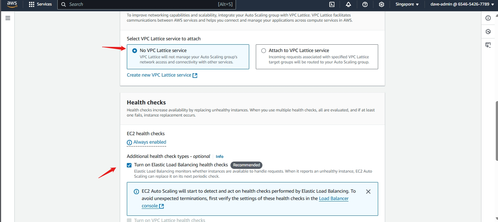

# Setting Up an Auto Scaling Group 

## Prerequisites
Before creating an Auto Scaling Group, ensure that:
- You have an **EC2 instance** or an **Amazon Machine Image (AMI)**.
- You've configured a **key pair** for SSH access.
- A **VPC** (Virtual Private Cloud) and **subnets** are available for your instances.
- Ensure that you have the necessary **IAM permissions** to create Auto Scaling Groups, Launch Templates, and EC2 Instances.

## Step 1: Create a Launch Template or Launch Configuration

A **Launch Template** or **Launch Configuration** defines the configuration for instances in your Auto Scaling Group, including the AMI, instance type, key pair, security group, and block storage options.

### Using the AWS Management Console:

1. **Navigate to the EC2 Dashboard**:
   - Log in to the AWS Management Console.
   - In the search bar, type "EC2" and select **EC2** from the results.

2. **Create a Launch Template**:
   - On the left sidebar, under **Instances**, click **Launch Templates**.


   - Click **Create launch template**.


   - Provide a **Name** and **Description** for the template.


   - Under **Source AMI**, select the AMI we made earlier.


   - Choose an **Instance type** (e.g., t2.micro for free tier).


   - Assign a **Key Pair** for SSH access to your instances.


   - In the **Network settings**, select your **VPC** and choose the subnet where your instances are located.
   - Under **Security Groups**, select the security group we chose earlier.


   - Leave storage as it is as it is already defined in the AMI.

   - Click **Create launch template**.

### Using AWS CLI:

You can also create a Launch Template using the AWS CLI:

```bash
aws ec2 create-launch-template \
    --launch-template-name alc-workshop-ec2-launchtemplate \
    --version-description "Initial version" \
    --launch-template-data '{
        "ImageId": "<ami-id>",
        "InstanceType": "<instance-type>",
        "KeyName": "<key-pair-name>",
        "SecurityGroupIds": ["<security-group-id>"]
    }'
```

1. **Replace** `<ami-id>`, `<instance-type>`, `<security-group-id>`, and `<key-pair-name>` with your values. For mine it would be:

```bash
aws ec2 create-launch-template \
    --launch-template-name alc-workshop-ec2-launchtemplate \
    --version-description "Initial version" \
    --launch-template-data '{
        "imageId": "ami-05d750b3a87a5af4c",
        "instanceType": "t2.micro",
        "keyName": "keypair",
        "securityGroupIds": ["sg-0c1b0b8939dd8ba1a"]
    }'

Source: 

```


## Step 2: Create an Auto Scaling Group

An Auto Scaling Group ensures that you always have the right number of EC2 instances running to handle your application's load. It automatically increases or decreases the number of instances according to your defined policies.

### Using the AWS Management Console:

1. Navigate to Auto Scaling Groups:
   - In the EC2 Dashboard, under Auto Scaling, click Auto Scaling Groups.


Click Create Auto Scaling group. 


1. Configure Basic Settings:
   - Name your Auto Scaling group. Select the Launch Template or Launch Configuration created earlier.


3. Choose a VPC and Subnets:
   - Select a VPC and subnets where your instances will be launched. Select all subnets for high availability.


4. Attach Load Balancers:
   - Attach our the target group on the load balancer we made to the Auto Scaling group.


5. For health check, select EC2 or ELB health check.



6. Configure Instance Scaling
   - Set the Minimum, Desired, and Maximum number of instances.
    Example:
     - Minimum: 2 - If one instance fails, the other will still handle traffic.
     - Desired: 3 - All target instances are running under normal circumstances.
     - Maximum: 5 - During traffic spikes or high demand periods


just click next until you reach the end.

6.  Review and Create:
   - Review the configuration and click Create Auto Scaling group.


### Using AWS CLI:

1. You can also create an Auto Scaling Group using the AWS CLI:

```bash
aws autoscaling create-auto-scaling-group \
    --auto-scaling-group-name <asg-name> \
    --launch-template LaunchTemplateName=<launch-template-name> \
    --min-size 2 \
    --max-size 5 \
    --desired-capacity 3 \
    --vpc-zone-identifier "<subnet-id,subnet-id2...>" \
    --tags Key=Name,Value=<asg-name>,PropagateAtLaunch=true
```

- Replace `<asg-name>` with the name of your Auto Scaling Group.
- Replace `<launch-template-name>` with the name of the Launch Template you created. Mine is `alc-workshop-ec2-launchtemplate`.
- Replace `<subnet-id>` with the subnet ID where your instances will be launched. Include all subnets as it will be used for high availability. Use this command to get all the subnet IDs in your VPC:

```bash
aws ec2 describe-subnets --query 'Subnets[*].[SubnetId, AvailabilityZone]' --output table
```


The subnet's are as follows: `subnet-0b8a1b62a519af134` , `subnet-0dde1c2d70e916cb2` and `subnet-08ce131ed07f297ce`.

- My command would be:

```bash
aws autoscaling create-auto-scaling-group \
    --auto-scaling-group-name alc-workshop-asg \
    --launch-template LaunchTemplateName=alc-workshop-ec2-launchtemplate \
    --min-size 2 \
    --max-size 5 \
    --desired-capacity 3 \
    --vpc-zone-identifier "subnet-0b8a1b62a519af134,subnet-0dde1c2d70e916cb2,subnet-08ce131ed07f297ce"  \
    --tags Key=Name,Value=alc-workshop-ec2-asg,PropagateAtLaunch=true
```

then use to verify the auto scaling group:
```bash
aws autoscaling describe-auto-scaling-groups --output table
```


2. Attach the Auto Scaling Group to the Load Balancer:
   - You can attach the Auto Scaling Group to the Load Balancer using the AWS Management Console or the AWS CLI. Run the following command:
  
```bash
aws autoscaling attach-load-balancer-target-groups \
    --auto-scaling-group-name alc-workshop-asg \
    --target-group-arns <your-target-group-arn>
```

- My target group ARN is `arn:aws:elasticloadbalancing:ap-southeast-1:654654267789:targetgroup/alc-workshop-ec2-TG/64d292c1d82539e6`.


- My command would be:

```bash
aws autoscaling attach-load-balancer-target-groups \
    --auto-scaling-group-name alc-workshop-asg \
    --target-group-arns arn:aws:elasticloadbalancing:ap-southeast-1:654654267789:targetgroup/alc-workshop-ec2-TG/64d292c1d82539e6
```


- Also verify the target group is attached to the Auto Scaling Group using the command:

```bash
aws autoscaling describe-auto-scaling-groups --auto-scaling-group-names <auto-scaling-group-name> --query "AutoScalingGroups[*].[AutoScalingGroupName,TargetGroupARNs]" --output table
```
- My command is:

```bash
aws autoscaling describe-auto-scaling-groups --auto-scaling-group-names alc-workshop-asg --query "AutoScalingGroups[*].[AutoScalingGroupName,TargetGroupARNs]" --output table
```


**Note**
- To verify auto scaling behaviour, refer to this documentation
https://docs.aws.amazon.com/sagemaker/latest/dg/endpoint-scaling-loadtest.html


#### Cleanup
- Remember to delete the Auto Scaling Group and Launch Template when you're done to avoid incurring unnecessary costs.
