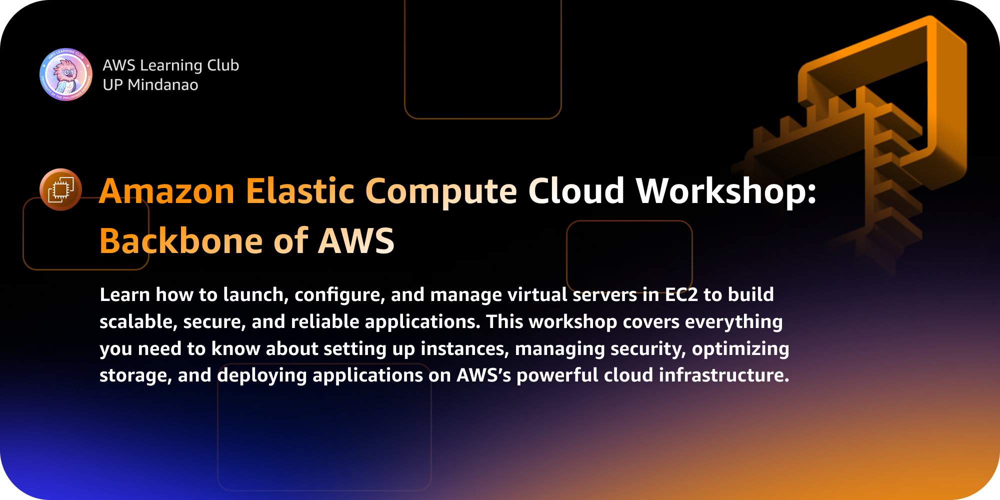

<!-- <h2 align="center">Strengthen Your AWS Account: Security 101 with IAM</h2> -->

<h1 align="center" style="border-bottom: none; ">Amazon Cloud Compute Workshop: Backbone of AWS</h1>

    
    
    

## **Table of Contents**
- [**Table of Contents**](#table-of-contents)
- [**Workshop Overview**](#workshop-overview)
- [**Prerequisites**](#prerequisites)
- [**Workshop Elements**](#workshop-elements)
  - [History of AWS](#history-of-aws)
  - [AWS Architecture](#aws-architecture)
  - [Creating an Instance](#creating-an-instance)
  - [Instance Connect](#instance-connect)
  - [Security Groups](#security-groups)
  - [S3 and IAM with EC2](#s3-and-iam-with-ec2)
    - [Creating an Admin IAM User](#creating-an-admin-iam-user)
  - [EC2 Amazon Machine Image](#ec2-amazon-machine-image)
  - [Elastic IP](#elastic-ip)
  - [Elastic Block Storage](#elastic-block-storage)
  - [Auto Scaling Group](#auto-scaling-group)
    - [Policy Simulator](#policy-simulator)
  - [Granting Billing Console Access](#granting-billing-console-access)
  - [Budget Alarms and Budget Creation](#budget-alarms-and-budget-creation)

## **Workshop Overview**

In this workshop, you'll gain a deep understanding of **AWS Elastic Compute Cloud (EC2)**, with a focus on launching and managing EC2 instances. Through hands-on activities, you'll learn to configure and secure your EC2 environments, manage instance types, and optimize performance for your applications.

By the end of the session, you will have the skills to effectively deploy, manage, and scale EC2 instances, ensuring high availability, security, and cost-efficiency in your AWS infrastructure.

## **Prerequisites**

Ensure you have the following tools installed before starting:

- **Windows Subsystem for Linux (WSL)**: [Install WSL](https://learn.microsoft.com/en-us/windows/wsl/install)
- **AWS CLI v2**: [Install AWS CLI v2](https://docs.aws.amazon.com/cli/latest/userguide/install-cliv2.html)
- **AWS IAM User with Admin Access:** [Create an IAM User](https://docs.aws.amazon.com/IAM/latest/UserGuide/id_users_create.html)

## **Workshop Elements**

### [History of AWS](01%20-%20AWS%20Getting%20Started.md)

This module covers the essential elements of AWS account structures and their importance for securing cloud resources. Topics include:

- **AWS Account Hierarchy**: Understand the different types of AWS accounts and their roles.
- **Account Settings and Configuration**: Learn how to configure your account for optimal security.
- **Security Best Practices**: Implement foundational security measures and understand AWS's built-in security features.

### [AWS Architecture](02%20-%20Shared%20Responsibility%20Model.md)

Dive deep into the Shared Responsibility Model, which defines the division of security responsibilities between AWS and its users. Key points include:

- **Understanding AWS Responsibilities**: What AWS manages, including hardware, software, networking, and facilities.
- **User Responsibilities**: Your role in managing data, applications, and access controls.
- **Security and Compliance**: How to leverage AWS tools and services to meet compliance requirements.

### [Creating an Instance](03%20-%20Creating%20AWS%20Account.md)

Learn the step-by-step process for creating and configuring AWS accounts, focusing on security and best practices:

- **Creating New Accounts**: Detailed instructions on setting up new AWS accounts.
- **Account Structure Best Practices**: Guidelines for organizing accounts for different environments (development, testing, production).
- **Account Security Configuration**: How to configure security settings and enable necessary features.

### [Instance Connect](04%20-%20Multi-factor%20Authentication.md)

Master the implementation of MFA to enhance account security. This module includes:

- **MFA Overview**: The importance of MFA in protecting AWS accounts.
- **Enabling MFA**: Step-by-step instructions for setting up MFA for root and IAM users.
- **MFA Types**: Different MFA methods (hardware tokens, mobile apps) and their applications.
- **Troubleshooting MFA Issues**: Common problems and how to resolve them.

### [Security Groups](05%20-%20AWS%20Identity%20and%20Access%20Management.md)

Explore the core components of IAM and how to use them effectively:

### [S3 and IAM with EC2](06%20-%20IAM%20Users%20and%20ARNs.md)
- **IAM Users**: How to create and manage IAM users.
- **Amazon Resource Names (ARNs)**: Understanding and using ARNs to specify resources.

#### Creating an Admin IAM User
- **Admin User Creation**: Detailed process for setting up an admin IAM user with appropriate permissions.
- **Securing Admin Users**: Best practices for securing admin accounts.

### [EC2 Amazon Machine Image](07%20-%20IAM%20Access%20Keys.md)
- **Generating Access Keys**: How to create and manage access keys for programmatic access.
- **Using AWS CLI v2**: Configuring and using AWS CLI v2 with access keys.

### [Elastic IP](08%20-%20IAM%20Groups.md)
- **IAM Groups**: How to create and manage IAM groups for organizing users.
- **Permissions Management**: Assigning permissions to groups and understanding permission policies.

### [Elastic Block Storage](10%20-%20IAM%20Roles.md)
- **Defining IAM Roles**: How to create and configure IAM roles for various use cases.

### [Auto Scaling Group](12%20-%20Simple%20Identity%20Policies%20in%20AWS.md)
- **Attaching Policies**: Best practices for attaching and managing policies.

#### Policy Simulator
- **Using the Policy Simulator**: How to test and validate IAM policies to ensure they meet your security requirements.
- **Interpreting Results**: Understanding simulation results to refine policies.

### [Granting Billing Console Access](14%20-%20Allowing%20Access%20to%20Billing%20Console.md)

Learn to manage access to the billing console:

- **Granting Access**: Detailed steps for providing IAM users with access to the billing console.
- **Configuring Billing Permissions**: Setting up appropriate permissions to control billing information access.
- **Monitoring Billing Activity**: How to monitor and review billing activity to ensure proper access controls.

### [Budget Alarms and Budget Creation](15%20-%20Creating%20a%20Budget%20and%20Setting%20up%20Budget%20Alarms.md)

Gain expertise in managing and controlling your cloud spend with these topics:

- **Creating Budget Alarms**: How to set up alarms for monitoring spending thresholds.
- **Setting Up Budgets**: Detailed steps to create and manage budgets within AWS.
- **Cost Optimization Tips**: Best practices for managing and reducing AWS costs.
- **Reviewing Budget Reports**: How to interpret budget reports and adjust configurations accordingly.
